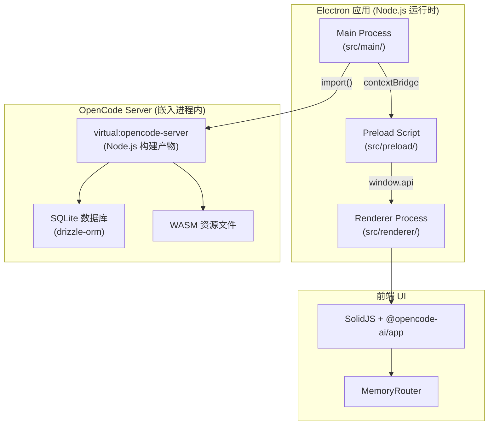
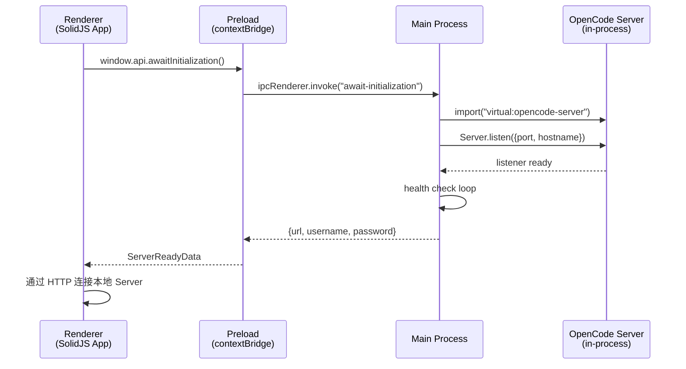

# desktop-electron 技术方案分析

## 一、整体架构概览



该项目从原本的 **Tauri v2** 方案迁移为 **Electron** 方案，核心策略是：

> **将 OpenCode Server 作为 Node.js 模块直接嵌入 Electron 主进程内运行**，而非作为外部 sidecar 进程。

---

## 二、核心技术栈

| 层级 | 技术选型 | 说明 |
|------|----------|------|
| **桌面框架** | Electron 41.x | 提供 Node.js 运行时环境 |
| **构建工具** | electron-vite 5.x + Vite | 三层构建（main/preload/renderer） |
| **打包分发** | electron-builder 26.x | 支持 macOS/Windows/Linux 多平台打包 |
| **前端框架** | SolidJS | 响应式 UI 框架 |
| **路由** | @solidjs/router (MemoryRouter) | 内存路由，非 URL 路由 |
| **数据库** | SQLite + drizzle-orm | 通过 `drizzle-orm/node-sqlite/driver` |
| **自动更新** | electron-updater | GitHub Release 自动更新 |
| **持久存储** | electron-store | 本地设置持久化 |
| **终端模拟** | @lydell/node-pty | 原生 PTY，跨平台 |
| **日志** | electron-log | 文件日志 + 自动清理 |

---

## 三、关键技术方案详解

### 3.1 Server 嵌入策略（最核心）

这是整个 Electron 版本最关键的设计：**不启动独立的 sidecar 进程，而是将 OpenCode 核心服务编译为 Node.js 模块，直接在 Electron 主进程中加载运行**。

#### 构建阶段

通过 [build-node.ts](file:///Users/lujs/opencode/packages/opencode/script/build-node.ts) 使用 `Bun.build()` 将 `opencode` 核心编译为 Node.js 目标产物：

```ts
await Bun.build({
  target: "node",           // 目标为 Node.js
  entrypoints: ["./src/node.ts"],
  outdir: "./dist/node",
  format: "esm",
  external: ["jsonc-parser", "@lydell/node-pty"],
  define: {
    OPENCODE_MIGRATIONS: JSON.stringify(migrations),  // 内嵌数据库迁移
  },
})
```

#### Vite 虚拟模块映射

在 [electron.vite.config.ts](file:///Users/lujs/opencode/packages/desktop-electron/electron.vite.config.ts) 中通过三个自定义 Vite 插件实现集成：

1. **`opencode:virtual-server-module`** — 将 `virtual:opencode-server` 映射到 `../opencode/dist/node/node.js`
2. **`opencode:node-pty-narrower`** — 将通用的 `@lydell/node-pty` 映射到平台特定包（如 `@lydell/node-pty-darwin-arm64`）
3. **`opencode:copy-server-assets`** — 构建后复制 `.wasm` 资源文件到输出目录

#### 运行时启动

在 [server.ts](file:///Users/lujs/opencode/packages/desktop-electron/src/main/server.ts#L33-L58) 中通过动态 import 启动：

```ts
async function spawnLocalServer(hostname, port, password) {
  prepareServerEnv(password)
  const { Log, Server } = await import("virtual:opencode-server")
  await Log.init({ level: "WARN" })
  const listener = await Server.listen({
    port, hostname,
    username: "opencode",
    password,
    cors: ["oc://renderer"],
  })
  // ... health check 轮询
}
```

> [!IMPORTANT]
> 这种方式完全避免了 sidecar 进程管理的复杂性（进程守护、信号转发、跨平台路径处理等），Server 的生命周期与 Electron 主进程绑定。

### 3.2 三层进程架构 (Main / Preload / Renderer)



#### Main Process ([src/main/](file:///Users/lujs/opencode/packages/desktop-electron/src/main/index.ts))

职责：
- 应用生命周期管理（单实例锁、信号处理）
- 启动嵌入式 OpenCode Server
- SQLite 数据库迁移（首次运行时）
- IPC Handler 注册
- 窗口管理（主窗口 + Loading 窗口）
- 菜单栏、自动更新、Deep Link 处理
- Shell 环境变量继承

#### Preload Script ([src/preload/](file:///Users/lujs/opencode/packages/desktop-electron/src/preload/index.ts))

通过 `contextBridge.exposeInMainWorld("window.api", ...)` 暴露安全的 IPC 桥接 API，涵盖 **40+ 个方法**，包括：

| 分类 | 方法 |
|------|------|
| 生命周期 | `killSidecar`, `awaitInitialization`, `relaunch` |
| 文件操作 | `openDirectoryPicker`, `openFilePicker`, `saveFilePicker` |
| 持久存储 | `storeGet/Set/Delete/Clear/Keys/Length` |
| 系统集成 | `openLink`, `openPath`, `readClipboardImage`, `showNotification` |
| 窗口管理 | `getWindowFocused`, `setWindowFocus`, `showWindow`, `setTitlebar` |
| 更新 | `checkUpdate`, `installUpdate`, `runUpdater` |
| 事件订阅 | `onMenuCommand`, `onDeepLink`, `onSqliteMigrationProgress` |

#### Renderer Process ([src/renderer/](file:///Users/lujs/opencode/packages/desktop-electron/src/renderer/index.tsx))

- 使用 SolidJS 渲染 `@opencode-ai/app` 共享 UI 组件
- 通过 `PlatformProvider` 注入平台适配层
- 使用 `MemoryRouter` 做内存路由
- 通过自定义协议 `oc://renderer` 加载本地资源

### 3.3 自定义协议与安全

在 [windows.ts](file:///Users/lujs/opencode/packages/desktop-electron/src/main/windows.ts#L12-L21) 中注册自定义协议 `oc://`：

```ts
protocol.registerSchemesAsPrivileged([{
  scheme: "oc",
  privileges: { secure: true, standard: true, supportFetchAPI: true },
}])
```

窗口安全配置：
- `contextIsolation: true` — 隔离 renderer 上下文
- `nodeIntegration: false` — 禁止 renderer 直接访问 Node API
- `sandbox: true` — 启用沙箱模式
- CORS 头注入 — 允许跨域请求嵌入式 server

### 3.4 SQLite 迁移策略

在 [index.ts](file:///Users/lujs/opencode/packages/desktop-electron/src/main/index.ts#L140-L217) 的初始化流程中：

1. 检查 SQLite 文件是否存在（`~/.local/share/opencode/opencode.db`）
2. 如果不存在（首次运行），执行 JSON 迁移 (`JsonMigration.run`)
3. 迁移过程有进度回调，通过 IPC 发送到 Loading 窗口
4. 如果迁移超过 1 秒，显示 Loading 窗口（含进度条）

### 3.5 Shell 环境继承

由于 macOS 上 GUI 应用启动时不会继承终端的环境变量，[shell-env.ts](file:///Users/lujs/opencode/packages/desktop-electron/src/main/shell-env.ts) 实现了 Shell 环境探测：

```
1. 尝试 shell -il -c "env -0"（交互式 + 登录 shell）
2. 超时/失败 → 尝试 shell -l -c "env -0"（仅登录 shell）
3. 仍失败 → 回退到应用进程环境
4. 特殊处理 nushell → 直接跳过
```

### 3.6 多渠道构建（dev/beta/prod）

通过 `OPENCODE_CHANNEL` 环境变量区分三个渠道：

| 渠道 | App ID | 产品名 | 自动更新 |
|------|--------|--------|---------|
| dev | `ai.opencode.desktop.dev` | OpenCode Dev | ❌ |
| beta | `ai.opencode.desktop.beta` | OpenCode Beta | ✅ (GitHub) |
| prod | `ai.opencode.desktop` | OpenCode | ✅ (GitHub) |

### 3.7 Tauri → Electron 迁移

[migrate.ts](file:///Users/lujs/opencode/packages/desktop-electron/src/main/migrate.ts) 实现了从 Tauri 版本的数据迁移：
- 自动查找 Tauri 数据目录下的 `.dat` 文件
- 将设置逐条迁移到 electron-store
- 不覆盖已存在的设置
- 一次性标记 `tauriMigrated = true`

---

## 四、与 Tauri 版本的关键区别

| 特性 | desktop (Tauri) | desktop-electron |
|------|----------------|-----------------|
| **运行时** | Bun（编译为独立二进制） | Node.js（Electron 内置） |
| **Server 部署** | 外部 Sidecar 进程 | 进程内嵌入（virtual module） |
| **原生层** | Rust (Tauri core) | Node.js + native addon |
| **前端渲染** | WebView (系统自带) | Chromium (Electron 内置) |
| **包体大小** | 较小（共享系统 WebView） | 较大（内含 Chromium） |
| **PTY 实现** | Rust 侧原生 PTY | @lydell/node-pty |
| **跨平台一致性** | 取决于系统 WebView 版本 | 高度一致（统一 Chromium） |
| **构建链** | Rust + Vite | Bun + electron-vite + electron-builder |

---

## 五、架构亮点总结

1. **进程内嵌入 Server** — 通过 Vite 虚拟模块 + `Bun.build(target: "node")` 将整个 OpenCode Server 编译为 Node.js ESM 模块，直接在 Electron 主进程中加载，消除了 sidecar 进程管理的复杂性。

2. **共享 UI 代码** — Renderer 层直接使用 `@opencode-ai/app` 和 `@opencode-ai/ui`，与 Web 版和 Tauri 版共享相同的 SolidJS 组件库。

3. **平台适配抽象** — 通过 `PlatformProvider` + `Platform` 接口，将桌面特有能力（文件选择器、剪贴板、通知、WSL）注入到共享 UI 中。

4. **安全的 IPC 设计** — 严格的 `contextIsolation + sandbox + contextBridge` 三层安全模型。

5. **优雅的初始化流程** — 首次迁移时展示带进度条的 Loading 窗口，迁移完成后无缝切换到主窗口。
