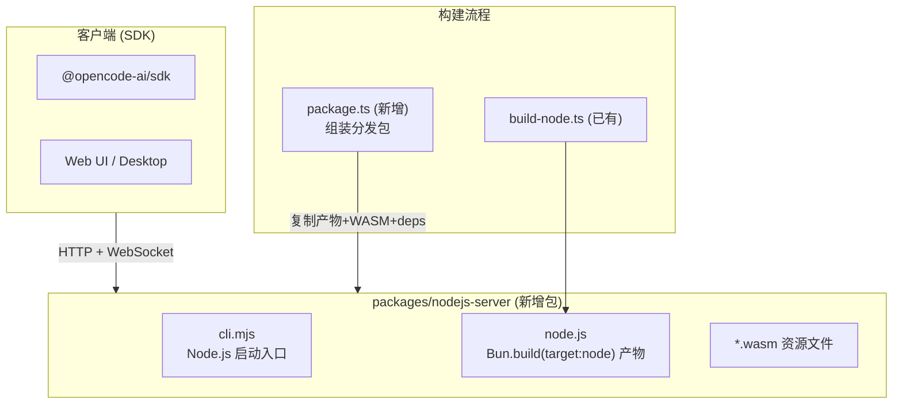

# OpenCode Node.js Server 独立分发包

## 背景

Windows 环境下 Bun 运行时存在崩溃问题，用户希望基于 Node.js 运行时构建 opencode server 独立版本（不含 CLI/TUI），通过 SDK 连接使用。

项目已具备 Node.js 运行时的核心抽象（`#db`、`#pty`、`#hono`），以及 `build-node.ts` 构建脚本和 `src/node.ts` 入口，desktop-electron 方案已验证可行。

---

## 架构概览



---

## 方案设计

### 核心思路

1. **直接复用** 已有的 `build-node.ts` 产出 `dist/node/node.js`
2. **新建 `packages/nodejs-server`** 作为独立可分发的 Node.js server 包
3. **包含一个自包含启动脚本** `cli.mjs`，支持命令行参数配置端口、主机名、认证等
4. **自动化构建脚本** 将产物、WASM 资源、外部依赖组装为可直接 `node` 运行的目录

### 包结构

```
packages/nodejs-server/
├── package.json           # npm 包描述, type: module
├── cli.mjs                # Node.js 启动入口（可直接运行）
├── script/
│   └── build.ts           # 构建 + 组装脚本
├── dist/                  # (构建产物，.gitignore)
│   ├── node.js            # 从 opencode/dist/node/ 复制
│   ├── chunks/            # code-split chunks
│   ├── *.wasm             # tree-sitter WASM 资源
│   ├── cli.mjs            # 启动脚本副本
│   └── package.json       # 分发用 package.json
└── README.md
```

---

## Proposed Changes

### 新增 `packages/nodejs-server` 包

#### [NEW] [package.json](file:///Users/lujs/opencode/packages/nodejs-server/package.json)

独立的 npm 包描述文件：

- `name`: `@opencode-ai/server`
- `type`: `module`
- `bin.nodejs-server`: `./cli.mjs`
- `dependencies`: `jsonc-parser`、`@lydell/node-pty`
- `optionalDependencies`: 各平台 `@lydell/node-pty-*` 预编译包（复用 desktop-electron 的列表）
- `engines`: `{ "node": ">=22.5.0" }`
- `scripts.build`: `bun run script/build.ts`

#### [NEW] [cli.mjs](file:///Users/lujs/opencode/packages/nodejs-server/cli.mjs)

Node.js 启动入口，功能：

1. 解析命令行参数（`--port`, `--hostname`, `--password`, `--username`）
2. 设置环境变量 `OPENCODE_SERVER_PASSWORD` / `OPENCODE_SERVER_USERNAME`（认证通过 `Flag` 模块从 `process.env` 读取）
3. 初始化 Log
4. 调用 `Server.listen()`
5. 输出服务地址
6. 保持进程运行
7. 处理 SIGINT/SIGTERM 优雅关闭

```js
#!/usr/bin/env node --experimental-sqlite
import { parseArgs } from "node:util"
import { Server, Log } from "./node.js"

const { values } = parseArgs({
  options: {
    port:     { type: "string", default: "4096" },
    hostname: { type: "string", default: "0.0.0.0" },
    password: { type: "string" },
    username: { type: "string", default: "opencode" },
  },
})

if (values.password) {
  process.env.OPENCODE_SERVER_PASSWORD = values.password
  process.env.OPENCODE_SERVER_USERNAME = values.username
}

await Log.init({ level: "INFO" })
const server = await Server.listen({
  port: Number(values.port),
  hostname: values.hostname,
})
console.log(`opencode server listening on http://${server.hostname}:${server.port}`)

const shutdown = async () => {
  await server.stop(true)
  process.exit(0)
}
process.on("SIGINT", shutdown)
process.on("SIGTERM", shutdown)
```

> [!IMPORTANT]
> 需要 `node --experimental-sqlite` 标志来启用 `node:sqlite`。在 shebang 中包含此标志，或在文档中说明运行方式。

#### [NEW] [script/build.ts](file:///Users/lujs/opencode/packages/nodejs-server/script/build.ts)

构建 + 组装脚本，执行以下步骤：

1. 调用 `packages/opencode` 的 `build-node.ts`（构建 Node.js 产物）
2. 清空并创建 `dist/` 目录
3. 复制 `packages/opencode/dist/node/` 下所有文件到 `dist/`
4. 从 `node_modules` 找到并复制 tree-sitter 相关 `.wasm` 文件到 `dist/chunks/`（与 Electron 方案一致）
5. 复制 `cli.mjs` 到 `dist/`
6. 生成分发用 `package.json`（含 dependencies 和 optionalDependencies）

#### [NEW] [README.md](file:///Users/lujs/opencode/packages/nodejs-server/README.md)

使用文档，覆盖：
- Node.js 版本要求（≥22.5.0）
- 安装方式
- 启动方式（含 `--experimental-sqlite` 标志说明）
- 命令行参数说明
- SDK 连接示例
- 环境变量配置

---

### 修改 `packages/opencode` 现有文件

#### [MODIFY] [build-node.ts](file:///Users/lujs/opencode/packages/opencode/script/build-node.ts)

**变更**：增加 WASM 文件自动复制逻辑。当前构建脚本不复制 `.wasm` 文件（这在 Electron 方案中由 Vite 插件处理），需要在构建完成后将 `web-tree-sitter`、`tree-sitter-bash`、`tree-sitter-powershell` 的 `.wasm` 文件复制到 `dist/node/chunks/`。

这样 `nodejs-server` 的构建脚本只需要简单地复制 `dist/node/` 目录即可。

---

### 修改 monorepo 根配置

#### [MODIFY] [package.json](file:///Users/lujs/opencode/package.json) (root)

在 `workspaces` 中添加 `packages/nodejs-server`（如果使用 workspaces 管理）。

---

## 功能保留分析

| 功能模块 | 是否保留 | 说明 |
|---------|---------|------|
| **HTTP Server + REST API** | ✅ | 通过 `#hono` Node.js 适配器 |
| **WebSocket (实时事件)** | ✅ | `@hono/node-ws` |
| **SQLite 数据库** | ✅ | `node:sqlite` + `drizzle-orm/node-sqlite` |
| **PTY 终端** | ✅ | `@lydell/node-pty` |
| **AI Provider 集成** | ✅ | 所有 `@ai-sdk/*` 均为纯 JS |
| **MCP 协议** | ✅ | 纯 JS 实现 |
| **插件系统** | ✅ | `Bun.$` 已有 `undefined` 降级 |
| **配置管理** | ✅ | 纯 FS 操作 |
| **Session 管理** | ✅ | 数据库操作 |
| **Agent 执行** | ✅ | ai-sdk 核心 |
| **文件监视** | ✅ | `@parcel/watcher` 或 `chokidar` |
| **Tree-sitter 解析** | ✅ | `web-tree-sitter` WASM（需复制资源文件） |
| **mDNS 发现** | ✅ | `bonjour-service` 纯 JS |
| **CLI / TUI** | ❌ | 不在 `node.ts` 入口中，不包含 |
| **Web UI 内嵌** | ❌ | 由 `build.ts` 处理，不在 Node 构建中 |

---

## Open Questions

> [!IMPORTANT]
> **better-sqlite3 vs node:sqlite**: `node:sqlite` 在 Node 22.x 仍是实验性 API。是否考虑增加一个 `better-sqlite3` 的条件导入分支以兼容更低版本的 Node.js？这会增加一些工作量但提升兼容性。当前方案假设使用 Node.js ≥22.5 + `--experimental-sqlite`。
> user-answer: 不需要

> [!IMPORTANT]
> **npm 分发形式**: 是否需要发布到 npm registry？还是仅作为本地构建使用？这会影响 `package.json` 的配置（`private` 字段、`publishConfig` 等）。
> user-answer: 不需要

> [!IMPORTANT]
> **认证方案**: 当前 Server 的认证通过环境变量 `OPENCODE_SERVER_PASSWORD` / `OPENCODE_SERVER_USERNAME` 实现。Node Server 版本是否需要额外的认证机制（如 token 生成）？当前设计沿用 CLI 的做法，通过 `--password` 参数或环境变量设置。
> user-answer: 不需要

> [!IMPORTANT]
> **Windows 平台测试**: `@lydell/node-pty` 在 Windows 上需要对应平台的预编译二进制包 (`@lydell/node-pty-win32-x64`)。是否需要在此阶段验证 Windows 兼容性？
> user-answer: 参考desktop_electron做法：  "optionalDependencies": {
    "@lydell/node-pty-darwin-arm64": "1.2.0-beta.10",
    "@lydell/node-pty-darwin-x64": "1.2.0-beta.10",
    "@lydell/node-pty-linux-arm64": "1.2.0-beta.10",
    "@lydell/node-pty-linux-x64": "1.2.0-beta.10",
    "@lydell/node-pty-win32-arm64": "1.2.0-beta.10",
    "@lydell/node-pty-win32-x64": "1.2.0-beta.10"
  }
---

## Verification Plan

### Automated Tests

1. **构建验证**:
   ```bash
   cd packages/opencode && bun script/build-node.ts
   cd packages/nodejs-server && bun script/build.ts
   ```
   确认 `dist/` 目录包含 `node.js`、`cli.mjs`、`*.wasm`、`package.json`

2. **启动验证**:
   ```bash
   cd packages/nodejs-server/dist
   node --experimental-sqlite cli.mjs --port 4096 --hostname 127.0.0.1
   ```
   确认服务启动并响应健康检查

3. **SDK 连接验证**:
   ```bash
   curl http://127.0.0.1:4096/global/health
   ```
   确认返回 200

### Manual Verification

- 在 Windows 环境下使用 Node.js 22.5+ 运行 server 并通过 SDK 连接
- 验证 session 创建、消息发送、工具执行等核心功能
