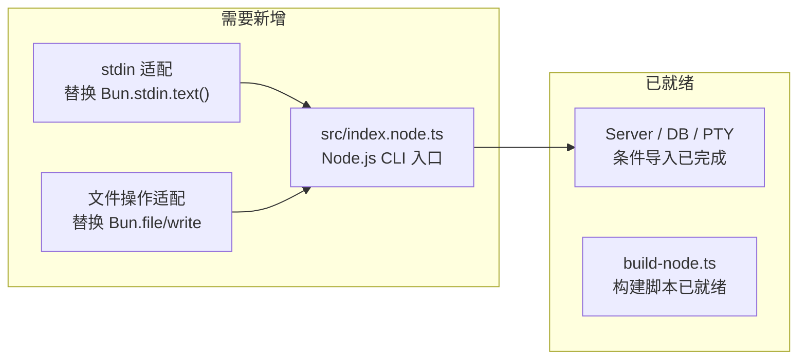

# Node.js 运行时版本可行性分析

## 一、结论：完全可参考 Electron 方案，且有现成基础

项目已经为 Node.js 运行时做了**大量的抽象工作**，desktop-electron 的方案直接可以复用。核心思路是：

> 使用 `Bun.build({ target: "node" })` 将 opencode 编译为 Node.js ESM 模块，运行时完全不依赖 Bun。

---

## 二、现有的运行时抽象层

项目通过 `package.json` 的 [imports](file:///Users/lujs/opencode/packages/opencode/package.json#L26-L42) 字段（Node.js Conditional Exports）实现了 Bun/Node 双运行时：

```json
"imports": {
  "#db":   { "bun": "./src/storage/db.bun.ts",    "node": "./src/storage/db.node.ts" },
  "#pty":  { "bun": "./src/pty/pty.bun.ts",        "node": "./src/pty/pty.node.ts" },
  "#hono": { "bun": "./src/server/adapter.bun.ts", "node": "./src/server/adapter.node.ts" }
}
```

### 三个抽象层详解

| 模块 | Bun 实现 | Node.js 实现 | 状态 |
|------|----------|-------------|------|
| **#db** (SQLite) | `bun:sqlite` + `drizzle-orm/bun-sqlite` | `node:sqlite` + `drizzle-orm/node-sqlite` | ✅ 已完成 |
| **#pty** (终端) | `bun-pty` | `@lydell/node-pty` | ✅ 已完成 |
| **#hono** (HTTP Server) | `Bun.serve()` + `hono/bun` | `@hono/node-server` + `@hono/node-ws` | ✅ 已完成 |

### 已有的 Node.js 入口点

[src/node.ts](file:///Users/lujs/opencode/packages/opencode/src/node.ts) 是专门为 Node.js 构建准备的入口，它只导出**服务端核心**（Server/Config/Log/Database/JsonMigration），不含 CLI/TUI 部分：

```ts
export { Config } from "@/config/config"
export { Server } from "./server/server"
export { bootstrap } from "./cli/bootstrap"
export * as Log from "@opencode-ai/core/util/log"
export { Database } from "@/storage/db"
export { JsonMigration } from "@/storage/json-migration"
```

### 已有的 Node.js 构建脚本

[script/build-node.ts](file:///Users/lujs/opencode/packages/opencode/script/build-node.ts) 已经实现了 Node.js 版本的构建：

```ts
await Bun.build({
  target: "node",               // 关键：目标为 Node.js
  entrypoints: ["./src/node.ts"],
  outdir: "./dist/node",
  format: "esm",
  sourcemap: "linked",
  external: ["jsonc-parser", "@lydell/node-pty"],  // 原生模块保持外部
  define: {
    OPENCODE_MIGRATIONS: JSON.stringify(migrations),
  },
})
```

---

## 三、Bun 特有 API 使用分析

以下是源码中所有使用 Bun 特有 API 的位置：

### 已通过条件导入隔离的（✅ 不影响 Node 构建）

| 文件 | Bun API | Node 替代 |
|------|---------|-----------|
| [db.bun.ts](file:///Users/lujs/opencode/packages/opencode/src/storage/db.bun.ts) | `import { Database } from "bun:sqlite"` | `node:sqlite` DatabaseSync |
| [pty.bun.ts](file:///Users/lujs/opencode/packages/opencode/src/pty/pty.bun.ts) | `import { spawn } from "bun-pty"` | `@lydell/node-pty` |
| [adapter.bun.ts](file:///Users/lujs/opencode/packages/opencode/src/server/adapter.bun.ts) | `Bun.serve()`, `hono/bun` | `@hono/node-server` |

### 仅在 CLI/TUI 中使用的（⚠️ 不在 `node.ts` 入口中）

| 文件 | Bun API | 说明 |
|------|---------|------|
| [run.ts:342](file:///Users/lujs/opencode/packages/opencode/src/cli/cmd/run.ts#L342) | `Bun.stdin.text()` | 仅 CLI `run` 命令读取 piped stdin |
| [thread.ts:68](file:///Users/lujs/opencode/packages/opencode/src/cli/cmd/tui/thread.ts#L68) | `Bun.stdin.text()` | TUI thread 命令 |
| [sound.ts:67-69](file:///Users/lujs/opencode/packages/opencode/src/cli/cmd/tui/util/sound.ts#L67-L69) | `Bun.file()`, `Bun.write()` | TUI 音效文件操作 |
| [editor-zed.ts](file:///Users/lujs/opencode/packages/opencode/src/cli/cmd/tui/context/editor-zed.ts) | `bun:sqlite`, `Bun.file()` | Zed 编辑器集成 |
| [win32.ts](file:///Users/lujs/opencode/packages/opencode/src/cli/cmd/tui/win32.ts) | `bun:ffi` | Win32 FFI 调用 |
| [plugin/index.ts:147](file:///Users/lujs/opencode/packages/opencode/src/plugin/index.ts#L147) | `Bun.$` | 插件执行（已有 `undefined` 降级） |
| [index.ts:40](file:///Users/lujs/opencode/packages/opencode/src/index.ts#L40) | `drizzle-orm/bun-sqlite` | 主入口 CLI 的数据库迁移 |

> [!IMPORTANT]
> `src/node.ts` 入口**不包含**任何 CLI/TUI 代码。所有 Bun 特有 API 都在 CLI 层，不影响 Node.js Server 构建。

---

## 四、两种 Node.js 发布方案

### 方案 A：纯 Server 模式（Headless）— 最简单，已几乎就绪

直接复用 `build-node.ts`，产出的 `dist/node/node.js` 就是一个纯 Node.js 的 OpenCode Server 模块。

```
opencode-node/
├── node.js          # ESM 入口（Bun.build target:node 产物）
├── *.wasm           # Tree-sitter 解析器等
├── package.json     # { "type": "module", "main": "node.js" }
└── node_modules/
    ├── @lydell/node-pty-<platform>/   # 原生 PTY
    └── jsonc-parser/                  # 外部依赖
```

使用方式：
```bash
node --experimental-sqlite ./node.js   # 作为库使用
# 或者包一个简单的 CLI 入口
```

**所需工作量**：几乎为 0，当前 `build-node.ts` 已经可以产出这个产物。

---

### 方案 B：完整 CLI 模式 — 需要额外适配

如果希望 `opencode run "xxx"` 这样的完整 CLI 也能在 Node.js 下运行，需要额外处理：



需要处理的改动：

| 改动 | 工作量 | 说明 |
|------|--------|------|
| 新建 `src/index.node.ts` | 小 | 从 `index.ts` fork，替换 `drizzle-orm/bun-sqlite` 为 `drizzle-orm/node-sqlite` |
| 替换 `Bun.stdin.text()` | 极小 | 改为 `process.stdin` 流式读取或 `fs.readFileSync(0, 'utf-8')` |
| 替换 `Bun.file/write` | 极小 | 改为 `fs.readFile / fs.writeFile` |
| 跳过 TUI 相关功能 | 中 | TUI 依赖 `bun:ffi`、`bun-pty` 等，Node 版可禁用 TUI 或仅保留 headless 命令 |
| 修改 `build-node.ts` | 小 | 增加完整 CLI 入口的构建 |

---

## 五、推荐方案

> [!TIP]
> **推荐从方案 A 开始**，产出一个可以 `node` 运行的 headless server + SDK，再按需扩展 CLI 命令。

### 具体步骤

1. **构建 Node.js 产物**
   ```bash
   cd packages/opencode && bun script/build-node.ts
   ```
   产出 `dist/node/node.js` + `*.wasm`

2. **创建 Node.js 启动脚本** `dist/node/cli.mjs`
   ```js
   import { Server, Log } from "./node.js"
   
   await Log.init({ level: "INFO" })
   const server = await Server.listen({
     port: 4096,
     hostname: "0.0.0.0",
   })
   console.log(`OpenCode server running at ${server.url}`)
   ```

3. **运行**（Node.js >= 22.5，内置 SQLite）
   ```bash
   node --experimental-sqlite ./dist/node/cli.mjs
   ```

4. **打包分发**
   ```
   opencode-server-node/
   ├── cli.mjs
   ├── node.js          # 主 bundle
   ├── chunks/          # code-split chunks
   ├── *.wasm
   ├── package.json
   └── node_modules/
       ├── @lydell/node-pty-darwin-arm64/
       └── jsonc-parser/
   ```

---

## 六、注意事项

### Node.js 版本要求

| 特性 | 最低版本 |
|------|---------|
| `node:sqlite` (SQLite) | Node.js 22.5.0 |
| ESM support | Node.js 18+ |
| `fetch` API | Node.js 18+ |
| `node:sqlite` 稳定版 | Node.js 23+ (experimental flag 可能需要) |

> [!WARNING]
> `node:sqlite` 在 Node 22.x 中仍是实验性 API，需要 `--experimental-sqlite` 标志。如果需要支持更低版本的 Node.js，可以考虑用 `better-sqlite3` 替代 `node:sqlite`，并添加一个新的条件导入分支。

### native addon 处理

`@lydell/node-pty` 是一个 native addon，需要按平台分发对应的预编译二进制。项目已经在 `package.json` 的 `optionalDependencies` 中配置了各平台的包（参考 desktop-electron 的做法）。

### WASM 文件

`build-node.ts` 构建时不包含 WASM 复制（那是 electron-vite 插件做的）。需要在 Node.js 分发包中手动包含 tree-sitter 的 `.wasm` 文件。
